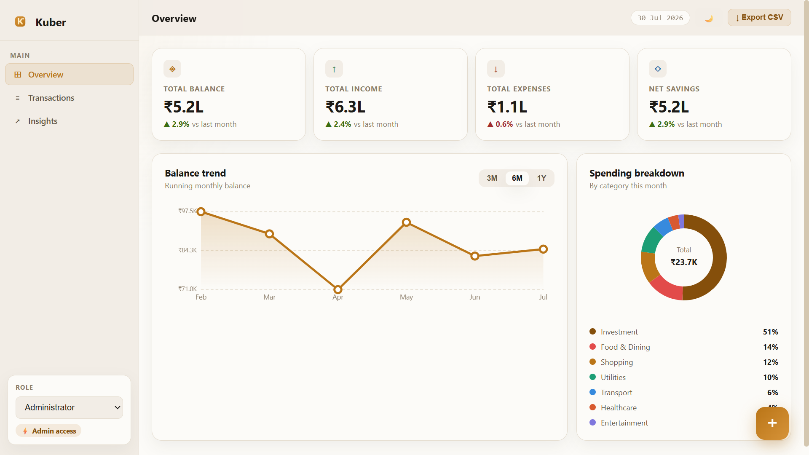
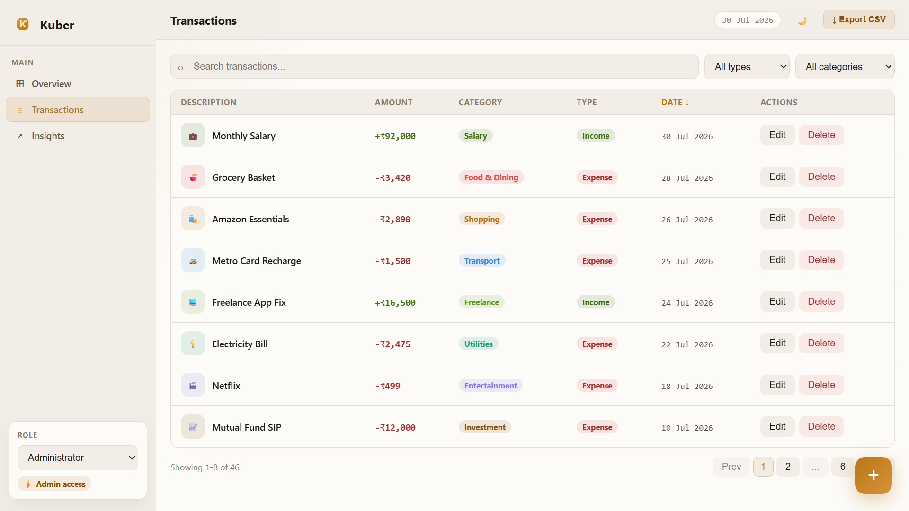
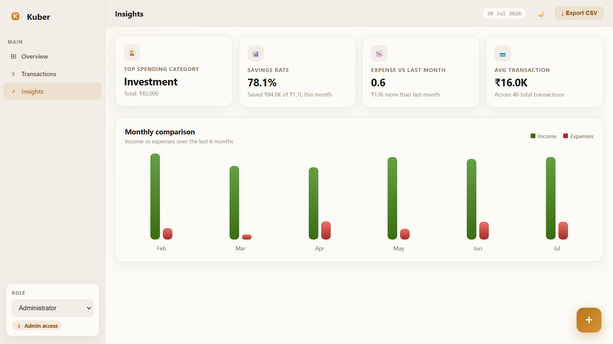

# 💰 Kuber

> A lightweight personal finance dashboard built with **React** and **Vite** for tracking transactions, analyzing spending, and exploring financial insights — all without a backend.

<p align="center">
  <a href="https://manishshw.github.io/Kuber/" target="_blank">
    
  </a>
  
  
  
</p>

## 🌐 Live Demo

👉 **https://manishshw.github.io/Kuber/**

---

## 📸 Preview









---

# ✨ Features

- 📊 Dashboard with Balance, Income, Expense & Savings cards
- 📄 Transaction management with:
  - Search
  - Filtering
  - Sorting
  - Pagination
- 📈 Monthly analytics and spending insights
- ➕ Add new transactions
- ✏️ Edit existing transactions
- 🗑️ Delete transactions
- 📤 Export transactions to CSV
- 🌗 Light / Dark mode
- 👤 Admin & Viewer role support
- 🌱 Seeded demo transactions
- ✨ Smooth UI animations
- 💾 Persistent storage using localStorage

---

# 🛠 Tech Stack

| Technology | Purpose |
|------------|----------|
| React 19 | UI Library |
| Vite 8 | Build Tool |
| Recharts | Charts & Graphs |
| CSS | Styling |
| localStorage | Data Persistence |

---

# 📂 Project Structure

```text
src/
│
├── App.jsx
│
├── components/
│   ├── Overview.jsx
│   ├── Transactions.jsx
│   ├── Insights.jsx
│   └── TxModal.jsx
│
├── utils/
│   ├── constants.js
│   └── helpers.js
│
└── index.css
```

---

# 🚀 Getting Started

## Prerequisites

- Node.js 18+
- npm

---

## Installation

```bash
git clone https://github.com/manishshw/Kuber.git

cd Kuber

npm install
```

---

## Start Development Server

```bash
npm run dev
```

Open

```
http://localhost:5173
```

---

## Build

```bash
npm run build
```

---

## Preview Production Build

```bash
npm run preview
```

---

## Run Linter

```bash
npm run lint
```

---

# ⚙️ How It Works

Kuber is a **frontend-only** application.

### First Launch

Transactions are initialized from

```text
src/utils/constants.js
```

### Afterwards

Data is automatically stored in

```text
localStorage
└── kuber_txs
```

This provides

- ✅ No backend required
- ✅ Instant performance
- ✅ Data persists after refresh

---

# 📊 Data Model

```javascript
{
  id: 26,
  desc: "Monthly Salary",
  amount: 85000,
  type: "income",
  cat: "Salary",
  date: "2026-04-02"
}
```

## Supported Types

| Type |
|------|
| income |
| expense |
| transfer |

---

# 🧠 Architecture

The application follows a simple architecture:

- Centralized state management in `App.jsx`
- Small reusable components
- Helper utility functions
- Browser localStorage persistence
- Frontend-only design
- Minimal and clean UI

---

# 🧪 Development Notes

### Reset Data

Delete

```text
localStorage
└── kuber_txs
```

or clear browser storage.

### Role Selector

- 👤 Admin → Full CRUD permissions
- 👀 Viewer → Read-only access

---

# 🔮 Future Improvements

- 🌐 Backend API integration
- 🔑 Authentication
- 📥 CSV Import
- 🔁 Recurring Transactions
- 🎯 Budget Planning
- 📈 Financial Goals
- ✅ Better Validation
- 🧪 Automated Testing

---

# 🤝 Contributing

Contributions are welcome!

1. Fork the repository
2. Create your feature branch

```bash
git checkout -b feature/NewFeature
```

3. Commit your changes

```bash
git commit -m "Add New Feature"
```

4. Push the branch

```bash
git push origin feature/NewFeature
```

5. Open a Pull Request

---

# 📄 License

This project is licensed under the **MIT License**.

---

<p align="center">
Made with ❤️ using React + Vite
</p>
